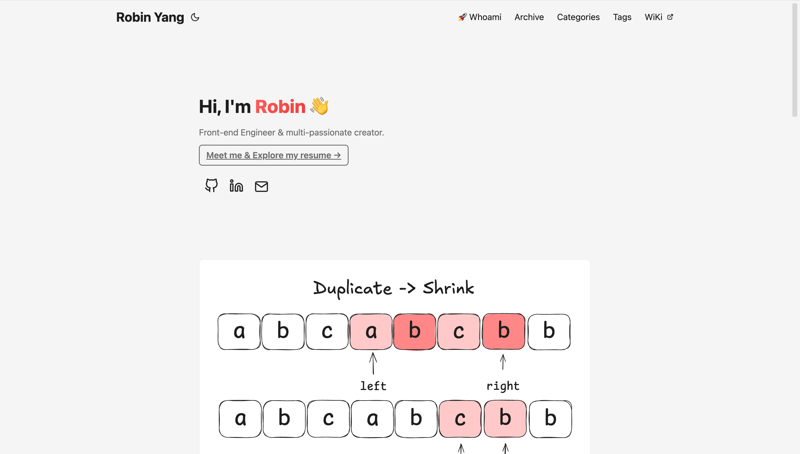

# Robin's Blog

Hi, I'm **Robin Yang** — a Senior Front-end Engineer based in Auckland, New Zealand, with 7+ years of experience at companies like ByteDance (TikTok) and Xiaomi. This is my corner of the web for sharing what I learn.

[**Visit the blog →**](https://yrbing.github.io/)

> 📝 **How this repo works:** [**Build a Modern Tech Blog: Hugo, GitHub Pages, and Zero-Maintenance CI/CD**](https://yrbing.github.io/posts/build-a-tech-blog-with-hugo-and-github-pages/) walks through the full setup behind this site, from `hugo new project` to the GitHub Actions pipeline that ships every push to `main`.

## What you'll find here

I write about the things I think about most as a frontend engineer:

- **Algorithms & problem solving** — deep-dives that trade jargon for intuition. Currently working through a sliding-window series.
- **Hugo & web tooling** — practical guides on building a fast, customizable static site, from math typesetting to custom shortcodes.
- **Modern frontend engineering** — notes on React, TypeScript, performance, and the patterns I rely on day to day.

## Featured series: Sliding Window

A three-part walkthrough of one of the most useful patterns in algorithm interviews — and how to recognize when it applies.

1. [**How to Solve Fixed-Length Sliding Window Problems**](https://yrbing.github.io/posts/fixed-length-sliding-window/) — the foundational pattern.
2. [**Reverse Thinking With Fixed-Length Sliding Window**](https://yrbing.github.io/posts/backward-thinking-with-sliding-window/) — when flipping the problem unlocks the solution.
3. [**The Core Patterns of Variable-Length Sliding Window**](https://yrbing.github.io/posts/variable-length-sliding-window/) — longest and shortest subarrays.

## Hugo engineering notes

- [**Build a Modern Tech Blog: Hugo, GitHub Pages, and Zero-Maintenance CI/CD**](https://yrbing.github.io/posts/build-a-tech-blog-with-hugo-and-github-pages/) — the full setup behind this site, from `hugo new project` to a working GitHub Actions pipeline.
- [**Math Typesetting in Hugo**](https://yrbing.github.io/posts/math-typesetting-in-hugo/) — conditionally loading KaTeX for fast, beautiful equations.
- [**How to Integrate Swiper.js with Hugo Shortcodes**](https://yrbing.github.io/posts/add-swiper-to-hugo-shortcodes/) — a reusable image carousel without bloating your markdown.

## About me

The [**About page**](https://yrbing.github.io/about/) has my full resume, featured projects ([Everyone Chess](https://everyone-chess.vercel.app/) — a React 19 + Stockfish WASM trainer), and a bit about life beyond the editor.
