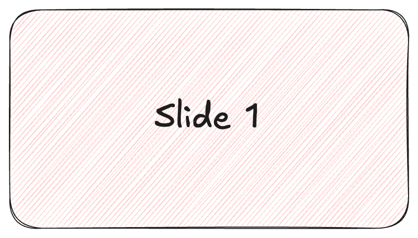
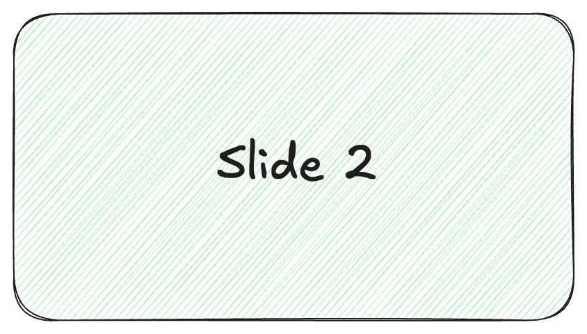
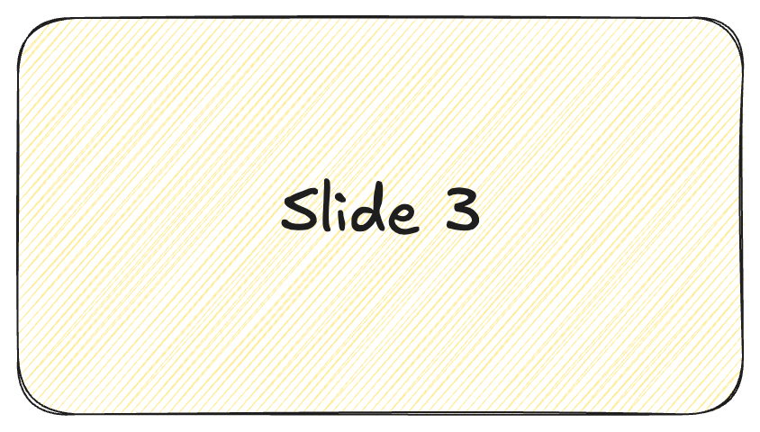

I’d like to add an image carousel / slider to my article. After some research, I found three common approaches:

- Hardcoding HTML directly into Markdown (tedious and hard to maintain).
- Using Hugo Modules (powerful but sometimes overkill for a simple slider).
- Creating a Custom Shortcode (the perfect balance of flexibility and performance).

In this post, I’ll show you how I built a robust, reusable Swiper component using the Shortcode approach. This method keeps your Markdown clean while ensuring your site stays fast.

## 🏗️ The Architecture

We will split the implementation into three clean parts:

- The Partial: A helper for asset management (Styles & Scripts).
- The Hook: Integrating the helper into your site's <head>.
- The Shortcode: The user-friendly Markdown interface.

### 1. The Asset Helper (`partials/helpers/swiper.html`)

Instead of cluttering your global CSS, we encapsulate everything in a dedicated helper. Note the use of `defer` and `window.onload` to ensure a smooth, non-blocking experience.

**Note:** Check the [latest Swiper Releases](https://swiperjs.com/get-started#use-swiper-from-cdn) to ensure you're using the most stable version.

```html
<!-- 1. Styles: Placed in Head to ensure proper layout before images load -->
<link
  rel="stylesheet"
  href="https://cdn.jsdelivr.net/npm/swiper@12/swiper-bundle.min.css"
/>
<style>
  .mySwiper {
    margin: 2em 0;
    width: 100%;
    aspect-ratio: 16 / 9;
    background: #eee;
    overflow: hidden;
    border-radius: 12px;
    box-shadow: 0 4px 12px rgba(0, 0, 0, 0.1);
  }
  .swiper-slide img {
    margin: 0;
    width: 100%;
    height: 100%;
    object-fit: contain;
    display: block;
  }
</style>

<!-- 2. Scripts: Added 'defer' to prevent blocking HTML rendering -->
<script
  defer
  src="https://cdn.jsdelivr.net/npm/swiper@12/swiper-bundle.min.js"
></script>

<!-- 3. Init Script -->
<script>
  document.addEventListener('DOMContentLoaded', function () {
    new Swiper('.mySwiper', {
      direction: 'horizontal',
      autoHeight: true,
      loop: true,

      autoplay: {
        delay: 3000,
        disableOnInteraction: false,
      },

      // If we need pagination
      pagination: {
        el: '.swiper-pagination',
        clickable: true,
      },

      // Navigation arrows
      navigation: {
        nextEl: '.swiper-button-next',
        prevEl: '.swiper-button-prev',
      },
    })
  })
</script>
```

### 2. The Hook (`layouts/partials/extend_head.html`)

In [PaperMod](https://github.com/adityatelange/hugo-PaperMod), you can inject assets via `extend_head.html`. Contents of [extend_head.html](https://adityatelange.github.io/hugo-PaperMod/posts/papermod/papermod-faq/#custom-head--footer) will be added to `<head>` of the page. If you use another theme, check its Documentation on _Partials_.

We don't want to load Swiper's 100KB+ assets on every page. We use Hugo's `.HasShortcode` function to keep our site lean.

```gotmpl
{{ if .HasShortcode "swiper" }}
  {{ partial "helpers/swiper.html" . }}
{{ end }}
```

### 3. The Shortcode (`layouts/shortcodes/swiper.html`)

With shortcodes, you can easily use Swiper in any page. We use `{{ .Inner }}` so you can pass custom HTML (like `` tags) directly from your Markdown.

```html
<!-- Slider main container -->
<div class="swiper mySwiper">
  <!-- Additional required wrapper -->
  <div class="swiper-wrapper">
    <!-- Slides -->
    {{ .Inner }}
  </div>
  <!-- If we need pagination -->
  <div class="swiper-pagination"></div>
  <!-- If we need navigation buttons -->
  <div class="swiper-button-prev"></div>
  <div class="swiper-button-next"></div>
</div>
```

## ✍️ Usage in Markdown

Now, adding a slider is as simple as this:

```markdown


  <div class="swiper-slide"></div>
  <div class="swiper-slide"></div>
  <div class="swiper-slide"></div>


```

Or use lazy loading for better initial performance:

```markdown


  <div class="swiper-slide">
    
    <div class="swiper-lazy-preloader"></div>
  </div>
  <div class="swiper-slide">
    
    <div class="swiper-lazy-preloader"></div>
  </div>
  <div class="swiper-slide">
    
    <div class="swiper-lazy-preloader"></div>
  </div>


```



  <div class="swiper-slide">
    
    <div class="swiper-lazy-preloader"></div>
  </div>
  <div class="swiper-slide">
    
    <div class="swiper-lazy-preloader"></div>
  </div>
  <div class="swiper-slide">
    
    <div class="swiper-lazy-preloader"></div>
  </div>



## ✨ Why this works:

- Smart Loading: Assets only appear on pages that actually contain a slider.
- SEO Friendly: Uses native `loading="lazy"` for high Core Web Vitals scores.

**Pro Tip:** If you use Hugo Extended, you can use Image Processing inside the shortcode to automatically generate WebP versions of your slides!

Have fun!
