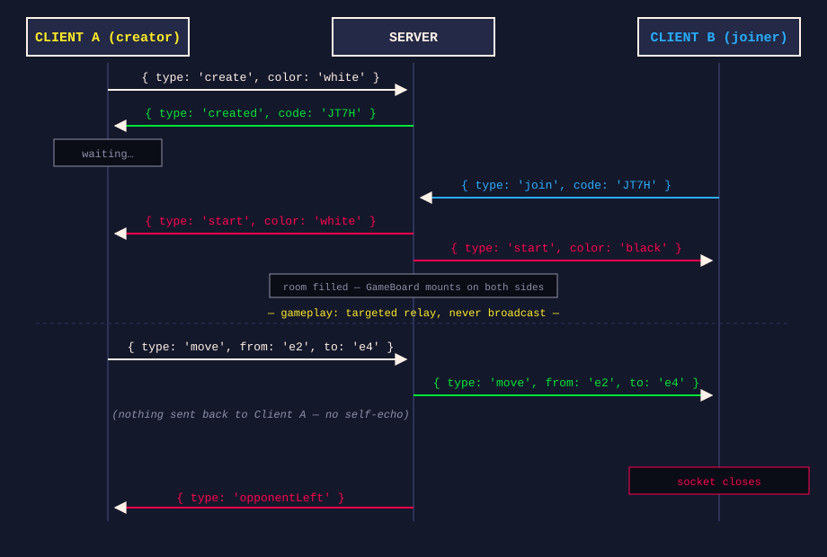
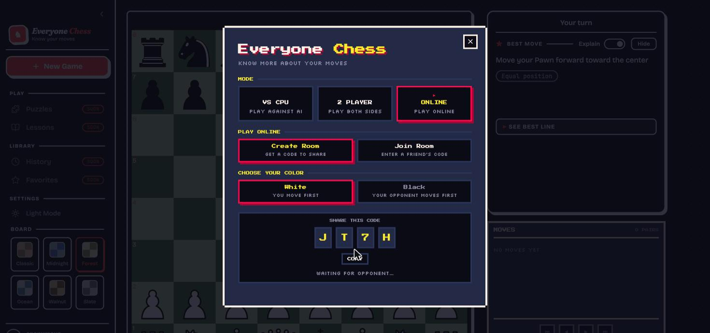
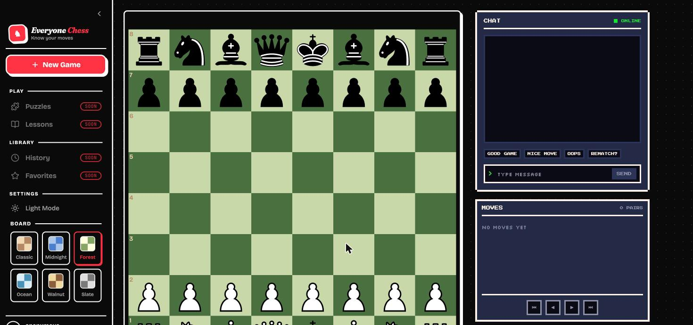
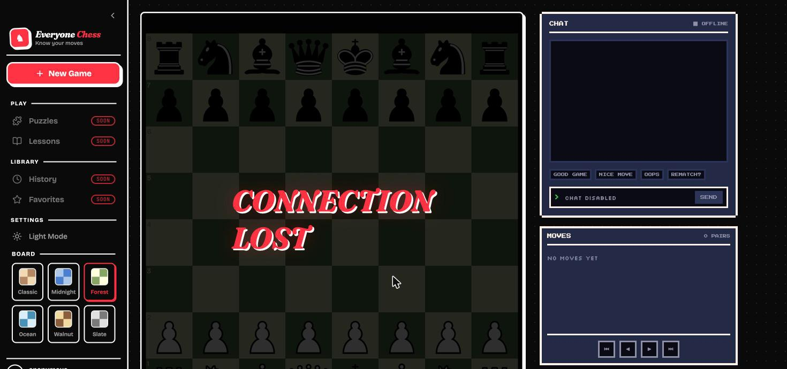

> 🔗 Live demo: https://everyone-chess.vercel.app/
>
> 💻 Code's on [GitHub](https://github.com/yrbing/everyone-chess) if you want to see the whole thing.

**Everyone Chess** is a browser chess app where a Stockfish-powered engine plays against you and explains its moves in plain natural language. It's always supported two people playing pass-and-play on one device, but never two people playing live from two different browsers.

## 🤔 Why not just poll?

Everything else in this app is request/response: ask Stockfish for a move, get one back. That model breaks down the moment two people need to talk to each other. When my opponent moves, I need to know immediately, not the next time I happen to ask. Polling ("any new moves yet?" every second) would technically work, but it's laggy and wasteful.

WebSocket solves this by upgrading a normal HTTP connection into a persistent, two-way pipe. Once it's open, either side can push a message any time, no request first, no reconnecting per message. That's the whole pitch: instead of "ask and wait," it's "stay connected and talk whenever."

WebSocket also isn't a new transport, it's built on top of TCP, the same protocol HTTP already uses. That matters here: TCP guarantees messages arrive in order and arrive at all, retransmitting anything lost. For a chess move, that's exactly what you want, a move that arrives twice or out of order is worse than one that arrives a beat late.

## 🔌 Learning the raw mechanics before touching chess

Before wiring anything chess-specific, step one is to try the smallest possible thing: a bare Node script using the `ws` package that just broadcasts whatever it receives to every connected client.

```js
// server/demo/server.mjs
const wss = new WebSocketServer({ port: 3001 })
const clients = new Set()

wss.on('connection', (socket) => {
  clients.add(socket)
  socket.on('message', (data) => {
    for (const client of clients) client.send(data.toString())
  })
  socket.on('close', () => clients.delete(socket))
})
```

Then came connecting to it by hand, from a browser console, with no framework in the way:

```js
const ws = new WebSocket('ws://localhost:3001')
ws.onmessage = (e) => console.log('received:', e.data)
ws.send('hello')
```

Watching two browser tabs both get the same message the instant one of them sent it: that was the moment WebSocket clicked for me. Every server I've built since is the same three event handlers (`connection`, `message`, `close`) doing something less naive with what arrives.

## ♟️ The real protocol: rooms, not broadcast

A chess game isn't "shout to everyone." It's "exactly two people, and only my opponent should hear from me." The app is an npm-workspaces monorepo (`client/`, `server/`, `shared/`), set up specifically so both sides could share one set of message types instead of hand-syncing two copies:

```ts
// shared/src/index.ts
export type ClientMessage =
  | { type: 'create'; color: 'white' | 'black' }
  | { type: 'join'; code: string }
  | { type: 'move'; from: string; to: string; promotion?: string }
  | { type: 'chat'; text: string }

export type ServerMessage =
  | { type: 'created'; code: string }
  | { type: 'start'; color: 'white' | 'black' }
  | { type: 'move'; from: string; to: string; promotion?: string }
  | { type: 'chat'; text: string }
  | { type: 'opponentLeft' }
  | { type: 'error'; message: string }
```

The server keeps a `Map<roomCode, Room>` instead of a flat `Set` of clients. `create` reserves a room and picks a side. `join` fills the empty slot and tells both sockets which color they got. `move` looks up the room, finds the other socket, and sends only to them:

```ts
case 'move': {
  const found = findRoom(socket)
  if (!found) { send(socket, { type: 'error', message: 'Not in a room' }); break }
  const [, room] = found
  const opponent = room.white === socket ? room.black : room.white
  if (opponent) send(opponent, { type: 'move', from: message.from, to: message.to, promotion: message.promotion })
  break
}
```

That's the whole conceptual leap from the demo server: broadcast-to-everyone becomes look-up-and-relay-to-one. Everything else, like chat and "opponent left" on disconnect, is the same shape.



Here's what that `created` message actually looks like on screen: the code the server hands back, ready to share.



## 🐛 The client hook, and a bug I didn't see coming

`useGameSocket` wraps the native `WebSocket` in a hook that opens once on mount and exposes typed actions:

```ts
useEffect(() => {
  const socket = new WebSocket(WS_URL)
  socketRef.current = socket
  socket.onmessage = (e) => onMessageRef.current(JSON.parse(e.data))
  return () => socket.close()
}, [])
```

The obvious way to write that `onmessage` handler is `onMessage(JSON.parse(e.data))`, calling the callback the hook was given directly. It got written that way first, and moves stopped updating the board correctly after the first render. The reason: this effect has an empty dependency array, so it runs once. Whatever `onMessage` closure existed at that moment gets baked in forever, even though the component using this hook (`App.tsx`) hands it a brand-new inline callback on every re-render. Classic stale closure.

The fix wasn't to add `onMessage` to the deps array, since that would tear down and reopen the socket on every render, which is worse. It's a ref that gets refreshed every render by a separate effect, while the socket-owning effect stays untouched:

```ts
const onMessageRef = useRef(onMessage)
useEffect(() => {
  onMessageRef.current = onMessage
}, [onMessage])
```

Now `socket.onmessage` reads `onMessageRef.current`, which is always fresh, without the socket itself ever needing to reconnect.

## 🔁 The second gotcha: an object that stays an object

Incoming moves and chat messages get funneled into state that a child component reacts to via `useEffect`:

```ts
const [incomingChat, setIncomingChat] = useState<{ text: string } | null>(null)
// ...
case 'chat': setIncomingChat({ text: msg.text }); break
```

Why wrap a string in `{ text: string }` instead of just storing the string? Because React bails out of a state update (and skips the effect) when the new value is `Object.is`-equal to the old one. If my opponent sends the same chat text twice in a row (`"gg"` then `"gg"` again, extremely plausible for a chat feature), `setIncomingChat("gg")` on top of an existing `"gg"` gets treated as no change at all, and the second message silently vanishes. A freshly built object literal, on the other hand, is never `===` to the previous one no matter what's inside it, so every message triggers the effect, every time.

## ⚠️ What happens when the connection dies

The last gap: if your own socket drops (a network blip, the free-tier server restarting, whatever), nothing told you. `send()` just silently no-ops once the socket isn't open anymore. The fix was the three WebSocket event handlers I hadn't used yet:

```ts
socket.onopen = () => setConnected(true)
socket.onclose = () => setConnected(false)
socket.onerror = () => console.error('WebSocket error')
```

(`onerror` carries almost no detail by design; browsers withhold it for security. But `onclose` always fires right after, so that's the one that actually matters.) `connected` now gates the UI: "Create Game"/"Join" disable with a "Connecting to server…" hint before the first handshake, and a "CONNECTION LOST" overlay replaces the board mid-game. Testing happened the honest way: a real game opened across two connections, then the server process got killed, and the UI reacted in real time instead of freezing silently.

| Before: a live game, socket open                                                                     | After: server killed mid-game                                                                                                          |
| ---------------------------------------------------------------------------------------------------- | -------------------------------------------------------------------------------------------------------------------------------------- |
|  |  |

## 🎯 Takeaways

- **WebSocket is one pipe, not a chat protocol.** It hands you raw two-way messages. Rooms, "who's my opponent," and reconnection are all yours to design; `ws` just does the handshake.
- **Broadcast-to-everyone becomes look-up-and-relay-to-one.** That's the entire conceptual jump from a toy chat demo to a real multiplayer protocol.
- **A stale closure and an `Object.is` bailout are the same bug wearing different hats.** React needs to see a new reference to know something changed. A ref refreshed every render, or a fresh object literal per message: both exist to give React that signal on purpose.
- **A WebSocket server needs a process that stays alive.** That one requirement rules out serverless and decides your whole deploy architecture.
- **Silence is the default failure mode.** `onclose` and `onerror` aren't optional extras. Without them, a dropped connection looks identical to a working one, right up until someone tries to move and nothing happens.
