Previously, we explored the fixed-length sliding window technique, which typically involves sliding a window of **_constant size_** by one element at a time. For a detailed explanation, refer to the article ------ 📝[How to Solve Fixed-Length Sliding Window Problems](/posts/fixed-length-sliding-window).

Now, we encounter a new class of problems that also appear solvable with a sliding window approach, but with a crucial difference: **_the window size is variable_**.

## Find the Longest Subarray

Given a string `s`, find the length of the **_longest substring_** without duplicate characters.

**Example:**

> **Input:** s = "abcabcbb"
>
> **Output:** 3
>
> **Explanation:** The answer is "abc", with the length of 3. Note that "bca" and "cab" are also correct answers.

**Constraints:**

- $0 <= s.length <= 5 * 10^4$
- `s` consists of English letters, digits, symbols and spaces.

### The Most Intuitive Solution - Brute Force

The brute force approach checks each substring independently.

We can fix either the left or right endpoint of the substring. In this implementation, we **fix the right endpoint and expand to the left** until encountering a duplicate character, recording the maximum length during the process.

```javascript
const lengthOfLongestSubstring = (s) => {
  const n = s.length
  let maxLen = 0

  // Fix the right endpoint of the substring
  for (let right = 0; right < n; right++) {
    const set = new Set()
    // Expand from the right endpoint to the left until a duplicate character is encountered
    for (let left = right; left >= 0; left--) {
      const char = s[left]
      // If a duplicate character is encountered, stop expanding
      if (set.has(char)) {
        break
      }
      set.add(char)
      // Update the maximum length
      maxLen = Math.max(maxLen, right - left + 1)
    }
  }

  return maxLen
}
```

The brute force solution has a time complexity of $O(n^2)$. **Its inefficiency stems from repeated computations**.

Specifically, it fails to leverage the problem's inherent **monotonicity**. For this problem, there is a crucial property:

> If the window `[left, right]` contains duplicate characters, then any larger window that contains it (i.e., `[p, q]` with `p ≤ left` and `q ≥ right`) must also contain duplicate characters.

### The Sliding Window Technique

The sliding window technique effectively addresses the inefficiencies of brute force by leveraging the problem's **monotonicity** to avoid redundant computations.

We use **two pointers** to represent the left and right boundaries of a substring (window).



  <div class="swiper-slide">
    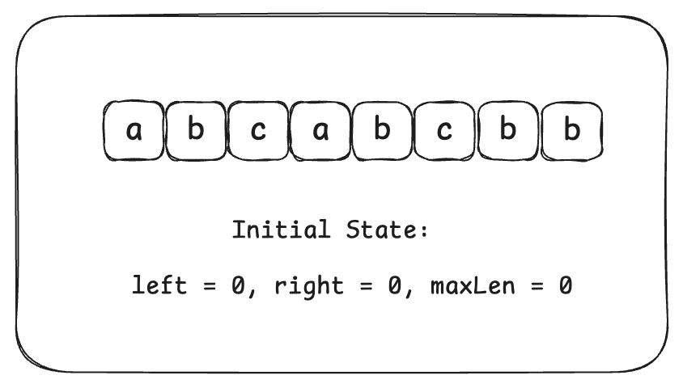
    <div class="swiper-lazy-preloader"></div>
  </div>
  <div class="swiper-slide">
    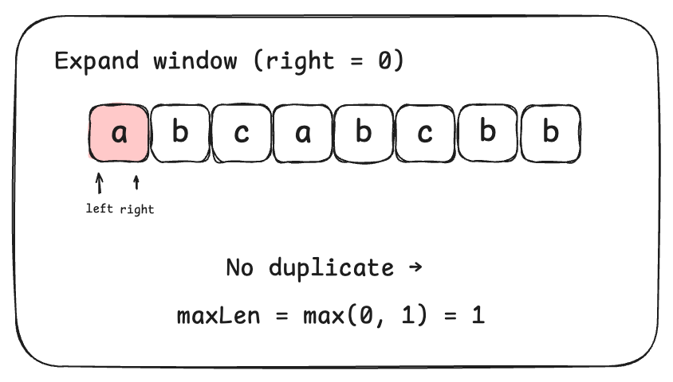
    <div class="swiper-lazy-preloader"></div>
  </div>  
  <div class="swiper-slide">
    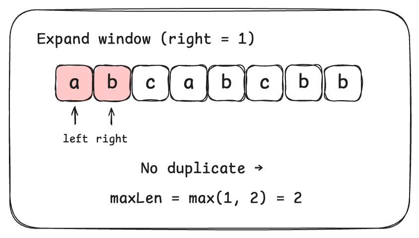
    <div class="swiper-lazy-preloader"></div>
  </div>  
  <div class="swiper-slide">
    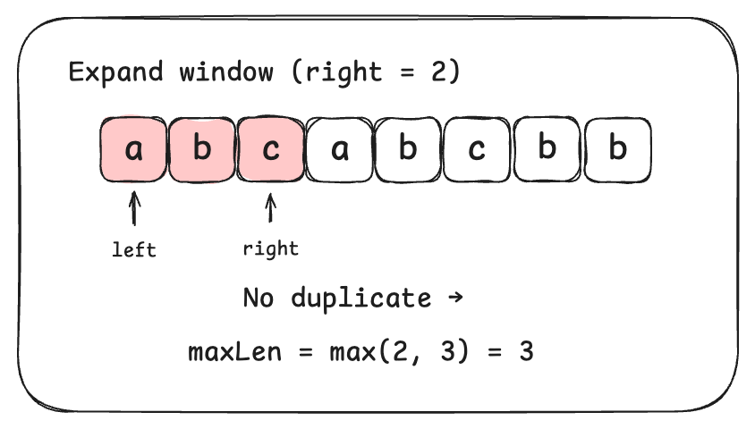
    <div class="swiper-lazy-preloader"></div>
  </div>  
  <div class="swiper-slide">
    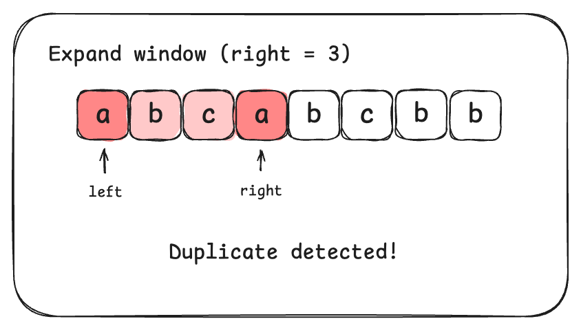
    <div class="swiper-lazy-preloader"></div>
  </div>  
  <div class="swiper-slide">
    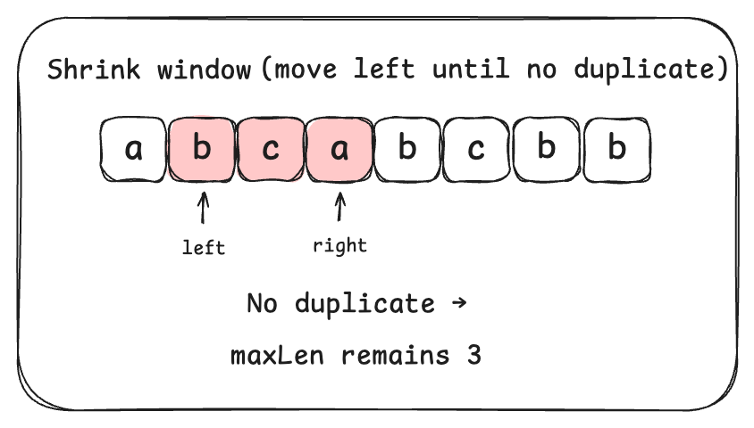
    <div class="swiper-lazy-preloader"></div>
  </div>  
  <div class="swiper-slide">
    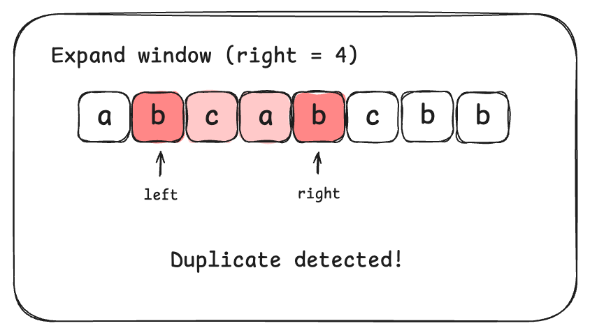
    <div class="swiper-lazy-preloader"></div>
  </div>  
  <div class="swiper-slide">
    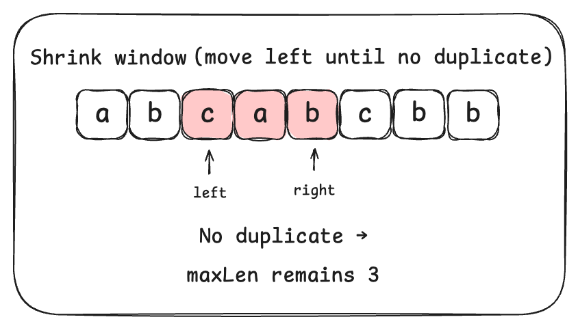
    <div class="swiper-lazy-preloader"></div>
  </div>  
  <div class="swiper-slide">
    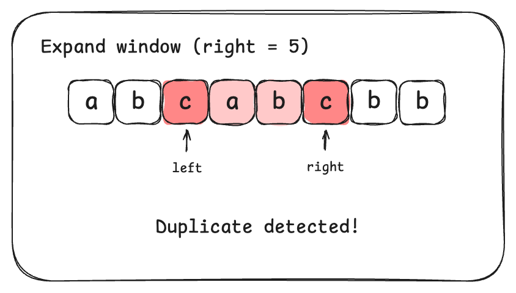
    <div class="swiper-lazy-preloader"></div>
  </div>  
  <div class="swiper-slide">
    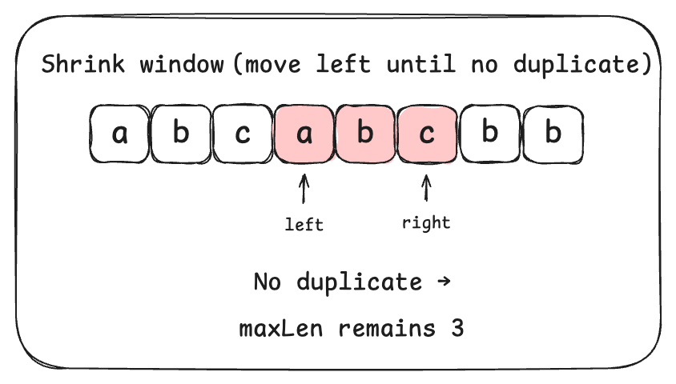
    <div class="swiper-lazy-preloader"></div>
  </div>  
  <div class="swiper-slide">
    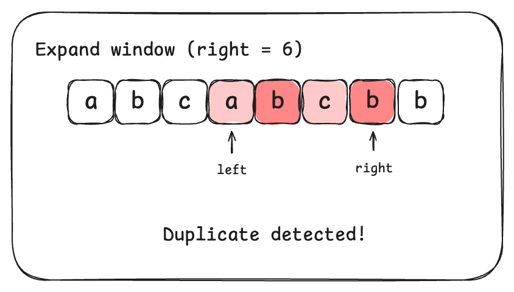
    <div class="swiper-lazy-preloader"></div>
  </div>  
  <div class="swiper-slide">
    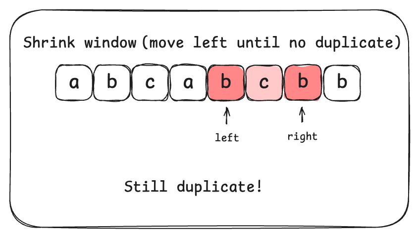
    <div class="swiper-lazy-preloader"></div>
  </div>  
  <div class="swiper-slide">
    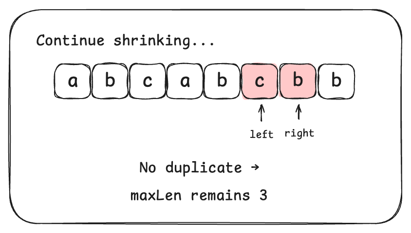
    <div class="swiper-lazy-preloader"></div>
  </div>  
  <div class="swiper-slide">
    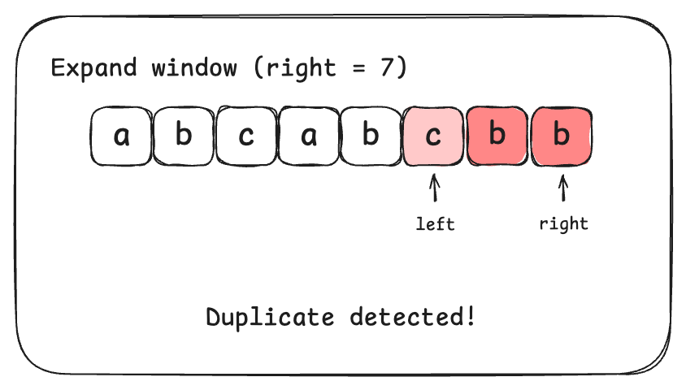
    <div class="swiper-lazy-preloader"></div>
  </div>  
  <div class="swiper-slide">
    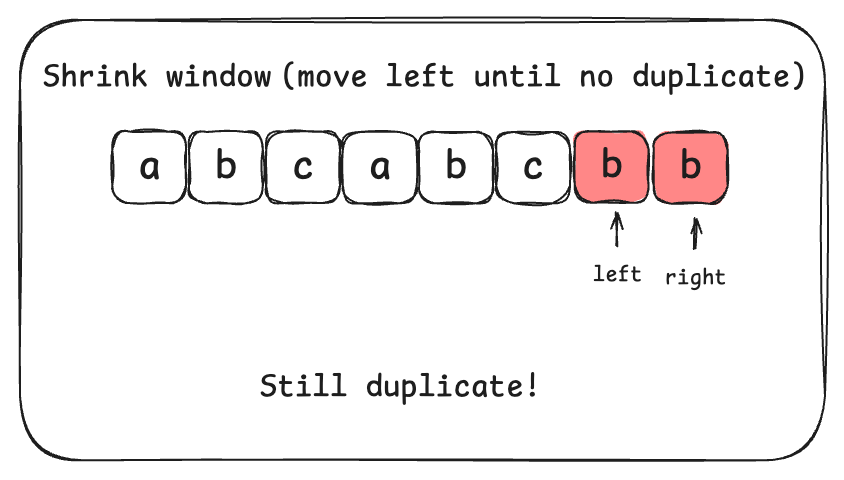
    <div class="swiper-lazy-preloader"></div>
  </div>
  <div class="swiper-slide">
    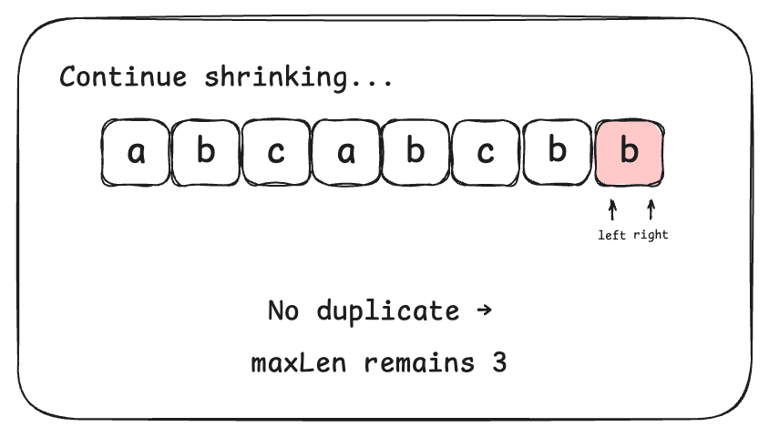
    <div class="swiper-lazy-preloader"></div>
  </div>



In each step, we move the right pointer one position to the right, expanding the window. As we expand, we track character frequencies.

When a duplicate character appears, we incrementally move the left pointer to the right, **shrinking the window until the duplication is resolved**.

This process ensures that the window always represents the longest valid substring **ending at the current right pointer**.

**Key Insight:** If the substring `s[left, right-1]` has no duplicate characters, but `s[left, right`] does, then the duplicate character must be `s[right]`.

```javascript
const lengthOfLongestSubstring = (s) => {
  let maxLen = 0
  let left = 0 // Left pointer of the sliding window
  const cnt = new Map() // Maintains character frequencies in the current window

  // Right pointer expands the window
  for (let right = 0; right < s.length; right++) {
    let c = s[right]
    cnt.set(c, (cnt.get(c) ?? 0) + 1)

    // If a duplicate character is found, shrink the window from the left
    while (cnt.get(c) > 1) {
      cnt.set(s[left], cnt.get(s[left]) - 1)
      left++
    }

    // Update the maximum window length
    maxLen = Math.max(maxLen, right - left + 1)
  }
  return maxLen
}
```

This approach calculates the longest valid substring for each possible ending position (right pointer).

**Complexity Analysis:**

- **Time Complexity**: $O(n)$
  - The outer for loop runs `n` times (once per character).
  - The inner while loop may appear to add complexity, but **each character enters and leaves the window at most once**.
  - Both pointers move from `0` to `n`, and each character is processed at most twice (once by `right` and once by `left`).
  - Therefore, the total operations are **2n = O(n)**.
- **Space Complexity:** $O(min(n, |Σ|))$
  - The Map stores character counts for the current window.
  - In the worst case, the window contains all distinct characters from the string.
  - The maximum number of distinct characters is bounded by:
    - **n**: the length of the string
    - **|Σ|**: the size of the character set (alphabet)
  - For ASCII: |Σ| = 128

The $O(n)$ Time complexity cannot be improved because we must examine each character at least once.

### Pattern: Finding the Longest Subarray

Finding the longest subarray typically involves problems with constraints like "at most" and exhibits the monotonicity property: **shorter windows are more likely to be valid**.

**Algorithm Template:**

```javascript
let left = 0
let maxLen = 0

for (let right = 0; right < n; right++) {
  // 1. Add nums[right] to the window, update state

  // 2. While the window does NOT satisfy the condition, shrink it
  while (windowDoesNotSatisfyCondition) {
    // Remove nums[left] and update state
    left++
  }

  // 3. At this point, the window satisfies the condition; update answer
  maxLen = Math.max(maxLen, right - left + 1)
}
```

**Key Steps:**

- **Expand:** The right pointer moves forward to include new elements.
- **Shrink:** When the window **violates the condition** (e.g., contains duplicates), move the left pointer inward until validity is restored.
- **Update:** After ensuring the window is valid, update the answer (e.g., maximum length).

## Find the Shortest Subarray

Given an array of positive integers `nums` and a positive integer `target`, return *the* **_minimal length_** *of a subarray whose sum is greater than or equal to* `target`. If there is no such subarray, return `0` instead.

**Example:**

> **Input:** target = 7, nums = [2,3,1,2,4,3]
>
> **Output:** 2
>
> **Explanation:** The subarray [4,3] has the minimal length under the problem constraint.

**Constraints:**

- $1 <= target <= 10^9$
- $1 <= nums.length <= 10^5$
- $1 <= nums[i] <= 10^4$

### The Sliding Window Technique

A brute force approach would be similar to the previous problem. We'll omit the code here and instead focus on optimizing it using the sliding window technique, which leverages a key **monotonicity** property inherent to the problem.

Because all numbers in the array are positive, expanding the window (by moving the right pointer) always increases the sum, while shrinking the window (by moving the left pointer) always decreases it. This creates a useful monotonic relationship:

> **longer windows are more likely to satisfy the sum condition**.
>
> Specifically, if a window `[left, right]` has a sum that meets or exceeds the target, then any larger window containing it (i.e., extending further to the right or starting earlier to the left) will also satisfy the condition. Conversely, if a window's sum is insufficient, shrinking it further will not help.

This monotonicity enables an efficient **two‑pointer strategy**: the right pointer expands the window to increase the sum, and once the sum **meets or exceeds the target**, the left pointer shrinks the window to find a **potentially shorter valid subarray**.



  <div class="swiper-slide">
    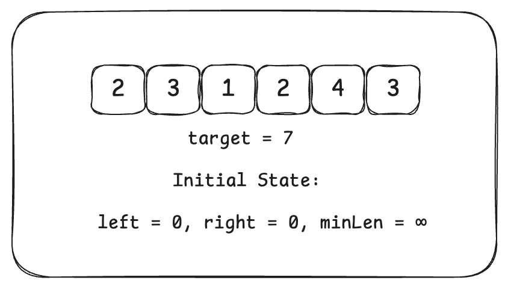
    <div class="swiper-lazy-preloader"></div>
  </div>
  <div class="swiper-slide">
    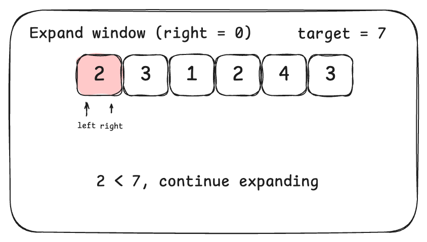
    <div class="swiper-lazy-preloader"></div>
  </div>  
  <div class="swiper-slide">
    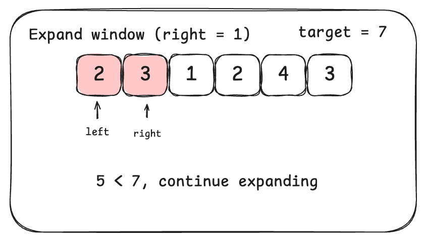
    <div class="swiper-lazy-preloader"></div>
  </div>  
  <div class="swiper-slide">
    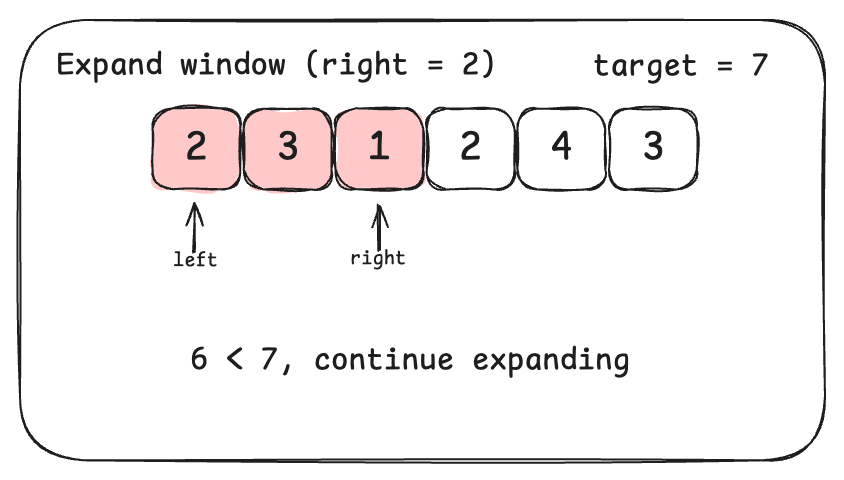
    <div class="swiper-lazy-preloader"></div>
  </div>  
  <div class="swiper-slide">
    
    <div class="swiper-lazy-preloader"></div>
  </div>  
  <div class="swiper-slide">
    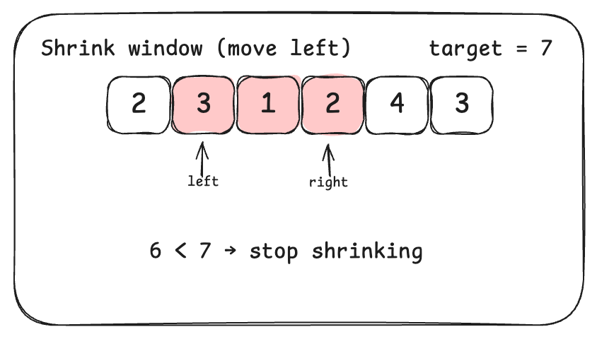
    <div class="swiper-lazy-preloader"></div>
  </div>  
  <div class="swiper-slide">
    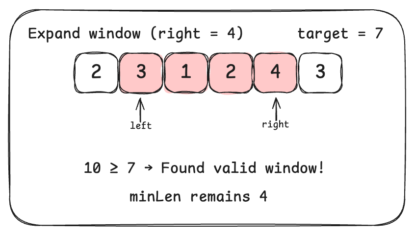
    <div class="swiper-lazy-preloader"></div>
  </div>  
  <div class="swiper-slide">
    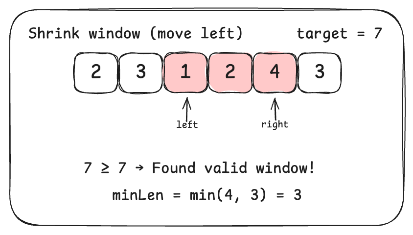
    <div class="swiper-lazy-preloader"></div>
  </div>  
  <div class="swiper-slide">
    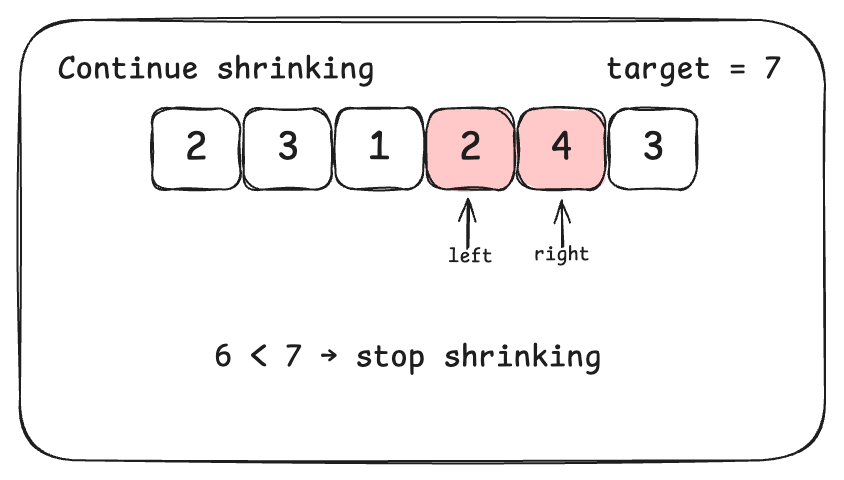
    <div class="swiper-lazy-preloader"></div>
  </div>  
  <div class="swiper-slide">
    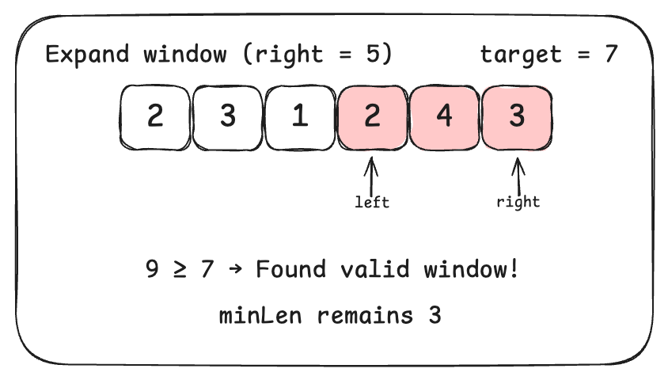
    <div class="swiper-lazy-preloader"></div>
  </div>  
  <div class="swiper-slide">
    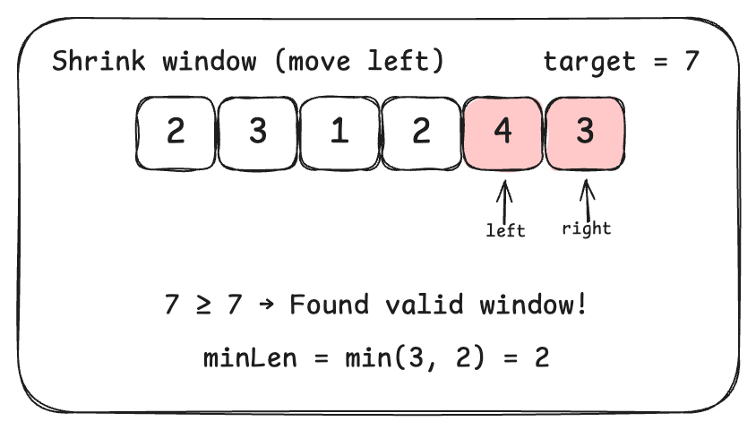
    <div class="swiper-lazy-preloader"></div>
  </div>  
  <div class="swiper-slide">
    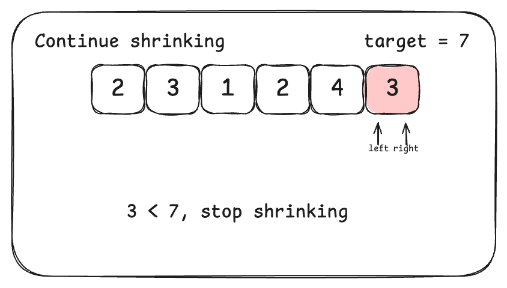
    <div class="swiper-lazy-preloader"></div>
  </div>



```javascript
const minSubArrayLen = function (target, nums) {
  let minLen = Infinity
  let sum = 0
  let left = 0 // Left pointer of the sliding window

  // Expand the window by moving the right pointer
  for (let right = 0; right < nums.length; right++) {
    // Add the current element to the window sum
    sum += nums[right]

    // Shrink the window from the left while the condition is satisfied
    while (sum >= target) {
      // Update the minimum length (window is [left, right])
      minLen = Math.min(minLen, right - left + 1)
      // Remove the leftmost element and shrink the window
      sum -= nums[left++]
    }
  }

  // If no valid subarray found, return 0, otherwise return minLength
  return minLen === Infinity ? 0 : minLen
}
```

**Complexity Analysis:**

- **Time Complexity**: $O(n)$ - each element is processed at most twice (once by right pointer, once by left pointer)
- **Space Complexity**: $O(1)$ - only uses a few variables

### Pattern: Finding the Shortest Subarray

Finding the shortest subarray typically involves constraints like "at least" and exhibits the monotonicity: **longer windows are more likely to be valid**.

**Algorithm Template:**

```javascript
let left = 0
let minLen = Infinity

for (let right = 0; right < n; right++) {
  // 1. Add nums[right] to the window, update state

  // 2. While the window satisfies the condition, attempt to shrink
  while (windowSatisfiesCondition) {
    // Before shrinking, the window still satisfies the condition; update answer
    minLen = Math.min(minLen, right - left + 1)
    // Remove nums[left] and update state
    left++
  }
}
```

**Key Steps:**

- **Expand:** The right pointer moves forward to include new elements.
- **Shrink:** When the window **satisfies** the condition (e.g., sum ≥ target), move the left pointer inward to find a potentially shorter valid window.
- **Update:** Update the answer (e.g., minimal length) **before** shrinking the window, as shrinking may break the condition.

## Summary and Comparison

|        Aspect         |                                Finding Longest                                 |                            Finding Shortest                            |
| :-------------------: | :----------------------------------------------------------------------------: | :--------------------------------------------------------------------: |
|     **Core Goal**     |            **Maximize** window size while satisfying the condition             |        **Minimize** window size while satisfying the condition         |
|   **Monotonicity**    |                  Shorter windows are more likely to be valid                   |               Longer windows are more likely to be valid               |
| **Shrinking Timing**  | Shrink when the window **does NOT satisfy**​ the condition (passive shrinking) | Shrink when the window **satisfies​** the condition (active shrinking) |
| **Shrinking Purpose** |                            Restore window validity                             |                      Find a smaller valid window                       |
|  **Answer Update​**   |                   After shrinking, when the window is valid                    |           Before shrinking, while the window is still valid            |
|   **Initial Value**   |                                   maxLen = 0                                   |                           minLen = Infinity                            |

## When to Use the Sliding Window Technique?

Consider the sliding window pattern for problems involving **searching for a continuous subarray or substring** that satisfies specific constraints.

1. If the required subarray/substring length is fixed, use a **fixed-length** sliding window.
2. If the length is variable, use a **variable-length** sliding window.
   - For **longest** subarray problems, the condition typically involves an upper limit (e.g., "at most K distinct characters").
   - For **shortest** subarray problems, the condition typically involves a lower limit (e.g., "sum at least target").

## To Be Continued: The Variable-Length Sliding Window Trilogy

The variable-length sliding window is essentially the most classic and patterned form of the "two pointers" technique where both pointers move in the same direction. It can be categorized into three main types: **finding the longest subarray, finding the shortest subarray, and counting the number of subarrays**.

Now that we’ve covered finding the longest and shortest subarrays, get ready to tackle the third classic use case: **counting subarrays**. More sliding window insights coming soon!
